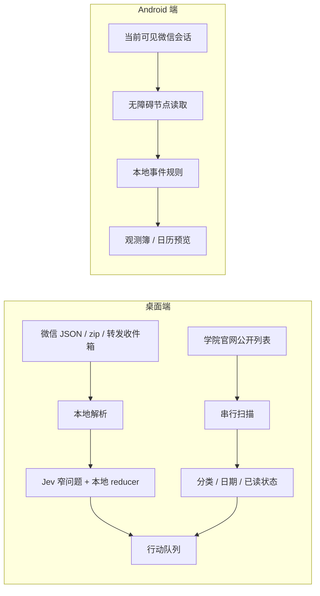

# 偷闲 · Touxian

把注意力留给重要的事。

偷闲是一套面向校园通知和高频消息场景的本地优先注意力工具，提供桌面端工作台和 Android 手机端。它们共享产品方向，但保持独立的运行边界：

- **桌面端**：整理微信群导出记录和温州大学学院官网公告，形成带截止日期、优先级、证据和归档状态的行动队列。
- **Android 端**：在用户主动打开的微信可见会话中识别事件、行动要求、日期和语境线索，提供悬浮窗、观测簿、完成归档和确认后写入日历。

这个仓库是**发布总仓库**，用于集中查看、构建和发布两个端的代码。平台源码仍保留在各自目录中，便于独立开发和独立发版。

> 当前版本：桌面端同步自 `sssssjw11/wzu-notice-scraper@126b45e`；Android 端同步自 `sssssjw11/attention-guard@f258b5b`（Android 1.22 预览版，versionCode 23）。

## 目录

- [产品定位](#产品定位)
- [平台能力](#平台能力)
- [快速开始](#快速开始)
- [桌面端](#桌面端)
- [Android 端](#android-端)
- [架构与数据边界](#架构与数据边界)
- [版本与发布](#版本与发布)
- [目录结构](#目录结构)
- [测试与验收](#测试与验收)
- [隐私与安全](#隐私与安全)
- [贡献](#贡献)
- [许可证与来源](#许可证与来源)

## 产品定位

群聊和学院官网里的重要信息，通常分散在通知、补充说明、改期和催办之间。偷闲把这些信息整理成可以核对、处理和找回的事项：

**发现值得关注的消息 → 查看原始依据 → 确认行动和期限 → 完成或归档。**

产品原则：

- **效率优先**：减少复制、切换和重复确认。
- **本地优先**：基础识别和数据保存默认在本机完成。
- **证据可查**：结果保留来源、时间、原文依据和处理记录。
- **边界清楚**：已读、已完成、超期归档和模型置信度不混成一个状态。
- **用户掌控**：不自动回复、不代发消息、不后台遍历全部微信群、不未经确认写入日历。

## 平台能力

| 能力 | 桌面端 | Android 端 |
| --- | --- | --- |
| 微信 `messages.json` 导入 | 支持 | 不适用 |
| 微信导出聊天记录 zip | 支持 | 不适用 |
| 本机微信只读导出 | 支持 | 读取当前可见会话 |
| 转发收件箱 | 支持 | 不适用 |
| 温州大学学院官网监测 | 支持 | 不适用 |
| 公告分类与发布日期 | 支持 | 不适用 |
| 截止日期与超期归档 | 支持 | 支持事件期限 |
| P0–P3 / 完成 / 归档 | 支持 | 支持事件完成和归档 |
| 微信悬浮窗 | 不适用 | 支持 |
| 意图和语境分析 | 可选 Jev / DeepSeek | 本地规则 |
| 日历写入 | 邮件摘要 | 用户确认后写入 |

桌面端和 Android 端不会互相读取对方的本地数据库，也没有总仓库级云端同步服务。需要同步时，应使用各端已有的导出、报告或系统账户能力。

## 快速开始

### 获取总仓库

```bash
git clone https://github.com/sssssjw11/touxian.git
cd touxian
```

### 只运行桌面端

Windows PowerShell：

```powershell
cd desktop\attention-desk
.\start.ps1 -Install
```

打开 `http://127.0.0.1:5173`。后端 API 默认是 `http://127.0.0.1:8765`。

### 只构建 Android 端

```bash
cd android
./gradlew :app:assembleDebug
```

Windows PowerShell：

```powershell
cd android
.\gradlew.bat :app:assembleDebug
```

APK 输出在：

```text
android/app/build/outputs/apk/debug/app-debug.apk
```

两个平台可以分别使用，不需要先启动另一端。

## 桌面端

桌面端源码位于 [`desktop/`](desktop/)，核心应用位于 [`desktop/attention-desk/`](desktop/attention-desk/)。

### 能做什么

- 导入 `messages.json`、微信聊天记录 zip 或转发收件箱。
- 只读读取本机微信已安装导出器或已有解密 SQLite。
- 选择消息日期范围和分析基准日。
- 使用本地 Jev 基线、TypeSafe Jev、DeepSeek 或自定义 Jev API。
- 按 P0–P3、待复核、今日截止、临近、宽裕和超期归档处理事项。
- 监测 22 个温州大学学院公开来源。
- 显示公告发布日期、比赛 / 活动、公示、其他公告分类。
- 按需读取公开正文，提取活动 / 报名截止日期和证据。
- 分开保存未读、已读完、已完成和超期状态。
- 学院来源拖动排序、右键置顶。
- 预览并确认发送 DDL 邮件摘要。

### 开发模式

```powershell
cd desktop\attention-desk
.\start.ps1 -Install
```

端口冲突时：

```powershell
.\start.ps1 -WebPort 5174 -ApiPort 8865
```

Linux / macOS：

```bash
cd desktop/attention-desk
python3 -m venv ../.venv
../.venv/bin/python -m pip install -r server/requirements.txt
npm ci
```

终端一启动 API：

```bash
../.venv/bin/python -m uvicorn server.main:app --host 127.0.0.1 --port 8765
```

终端二启动前端：

```bash
ATTENTION_API_PORT=8765 npm run dev -- --host 127.0.0.1 --port 5173
```

### 本地生产模式

```bash
cd desktop/attention-desk
npm ci
npm run build
../.venv/bin/python -m uvicorn server.main:app --host 127.0.0.1 --port 8765
```

打开 `http://127.0.0.1:8765`。FastAPI 会直接提供 `dist/` 中的页面和 `/api/*` 接口。

### 桌面端文档

- [桌面端使用和部署手册](desktop/attention-desk/README.md)
- [产品需求与体验重构记录](desktop/attention-desk/PRODUCT_REQUIREMENTS.md)
- [版本改进记录](desktop/attention-desk/VERSION_NOTES.md)

## Android 端

Android 端源码位于 [`android/`](android/)，是 Kotlin 原生 Android 应用，当前版本为 1.22 预览版。

### 安装发布 APK

正式下载、SHA-256 和发布说明以 Android 子仓库的 Release 为准：

- [Android Releases](https://github.com/sssssjw11/attention-guard/releases)
- [1.22 预览版](https://github.com/sssssjw11/attention-guard/releases/tag/v1.22)
- [当前 APK 下载](https://github.com/sssssjw11/attention-guard/releases/download/v1.22/touxian-1.22-debug.apk)

系统要求：Android 11 / API 30 及以上。当前发布包使用 debug 签名，不能和其他签名的同包名应用直接覆盖。

ADB 安装：

```bash
adb install -r touxian-1.22-debug.apk
```

### Android 端功能

- 微信当前可见文字会话的事件监测。
- 微信悬浮窗、紧凑工具条和小球三级显示。
- 事件类型、行动要求、期限、重要性和原始依据。
- 微信意图 / 语境分析和自由文本分析。
- 观测簿搜索、完成、归档和恢复。
- 用户确认后写入系统日历，默认提醒方式为开始时。
- 主动启动的有界历史回溯。
- 本机 OCR 和运行诊断。
- 可选 DeepSeek 事件增强，默认关闭。

### Android 端构建

环境要求：

- JDK 17。
- Android SDK Platform 35。
- Build Tools 35.0.0。
- 使用仓库 Gradle Wrapper，Gradle 8.9。

```bash
cd android
./gradlew :app:assembleDebug
./gradlew :app:testDebugUnitTest
```

Windows PowerShell：

```powershell
cd android
.\gradlew.bat :app:assembleDebug
.\gradlew.bat :app:testDebugUnitTest
```

Release 签名配置必须放在仓库外，并通过 `ATTENTION_GUARD_KEYSTORE_PROPS` 指定；不要提交密钥库、密码或 `local.properties`。

### Android 端文档

- [Android 端完整说明](android/README.md)
- [设计文档](android/DESIGN.md)
- [交互约定](android/UX-CONTRACT.md)
- [1.22 发布说明](android/docs/releases/v1.22.md)
- [真机验收记录](android/docs/device-acceptance-1.22.md)

## 架构与数据边界



### 桌面端边界

- 本地 Jev 模式不上传聊天内容。
- 只有用户选择远程判断时，候选消息片段和可选画像才发送到填写的 API。
- API key 只用于当前请求，不写入仓库。
- 官网只访问公开温州大学域名，不绕过认证或验证码。
- 转发收件箱按内容哈希去重，原始 zip 只读复制。

### Android 端边界

- 只处理用户主动打开、当前可见的微信内容。
- 不读取微信数据库，不 hook 微信，不自动发送消息、转账或红包。
- 意图分析和自由文本分析不写入事件簿。
- DeepSeek 增强默认关闭，开启后只发送符合条件的事件上下文。
- 日历只有在用户确认后才写入。

## 版本与发布

总仓库发布不替代两个子项目的独立版本：

| 端 | 来源仓库 | 当前同步提交 / 版本 | 构建产物 |
| --- | --- | --- | --- |
| Desktop | [wzu-notice-scraper](https://github.com/sssssjw11/wzu-notice-scraper) | `126b45e` | 本地 Web / FastAPI |
| Android | [attention-guard](https://github.com/sssssjw11/attention-guard) | `f258b5b` / 1.22 | Debug APK |

同步流程：

1. 先在原始仓库完成代码和测试。
2. 在本仓库对应目录更新快照。
3. 更新本 README 的同步提交和版本号。
4. 分别运行桌面端和 Android 端的构建 / 回归。
5. 为总仓库打发布标签，并在两个来源仓库保留可追溯链接。

总仓库目前不承诺自动同步。两个来源仓库的新提交不会自动出现在这里，必须经过一次人工同步和验证。

## 目录结构

```text
touxian/
├── README.md
├── desktop/                         # 温州大学通知抓取器 + Attention Desk
│   ├── attention-desk/              # React + FastAPI 桌面工作台
│   ├── .agents/                     # 公告分拣技能和 JEV 规则
│   ├── data/                        # 版本化站点目录和演示数据
│   ├── scrape.py                    # 官网通知列表抓取
│   ├── download.py                  # 正文、图片和附件下载
│   └── ...
└── android/                         # Kotlin Android 应用
    ├── app/
    ├── docs/
    ├── scripts/
    └── ...
```

运行时数据、构建产物和私人记录不应进入总仓库：

- 桌面端：`desktop/data/attention-desk/`、`desktop/data/contacts/`、`desktop/out/`、`desktop/download/`、`desktop/attention-desk/node_modules/`。
- Android：`android/.gradle/`、`android/local.properties`、`android/app/build/`、签名文件和密钥配置。

## 测试与验收

### 桌面端

```bash
cd desktop
python -m pytest attention-desk/server -q
cd attention-desk
npm ci
npm run build
```

### Android 端

```bash
cd android
./gradlew :app:testDebugUnitTest
./gradlew :app:assembleDebug
```

需要真机时，再按 Android 子仓库中的验收记录安装 APK；模拟器结果不能替代无障碍、悬浮窗和微信版本的真机覆盖。

本次总仓库同步时，桌面端回归和构建已在当前环境通过；Android Gradle 任务因当前机器未配置 Android SDK 未重跑。Android 的历史测试与真机范围以 [`android/README.md`](android/README.md) 和 [`android/docs/device-acceptance-1.22.md`](android/docs/device-acceptance-1.22.md) 为准。

## 隐私与安全

- 只处理自己有权查看的聊天和公开官网内容。
- 不提交真实聊天记录、截图、数据库、API key、令牌、证书或签名文件。
- 远程模型调用前确认服务商的数据处理、费用和留存政策。
- 重要期限、行动和人际判断始终以原始消息和用户确认作为最终依据。
- 若公开发布构建产物，请同时提供版本号、签名类型、校验值和已知限制。

## 贡献

欢迎提交：

- 桌面端来源解析和状态逻辑修复。
- Android 端设备兼容性、无障碍读取和交互改进。
- 去标识的回归样例和可复现测试。
- 文档、构建和发布流程改进。

提交前请确认：

1. 修改只放在对应平台目录，避免把桌面端和 Android 端的运行时依赖混在一起。
2. 不绕过认证、验证码、系统权限或第三方平台访问控制。
3. JEV / 本地规则变化有对应测试和证据说明。
4. 设备日志、截图和样例已经去除姓名、群名、号码、邮箱和密钥。

## 许可证与来源

本总仓库由两个独立项目组成：

- 桌面端代码和原始温大抓取器：见 [`desktop/LICENSE`](desktop/LICENSE)。
- Android 端代码：见 [`android/LICENSE`](android/LICENSE)。
- 两个项目均采用 MIT License，但版权声明和贡献来源分别保留。

来源仓库：

- [sssssjw11/wzu-notice-scraper](https://github.com/sssssjw11/wzu-notice-scraper)
- [sssssjw11/attention-guard](https://github.com/sssssjw11/attention-guard)
- 桌面端合作与贡献说明：[`desktop/CREDITS.md`](desktop/CREDITS.md)

偷闲是独立项目，不隶属于微信、腾讯、DeepSeek、温州大学或任何参考项目。
