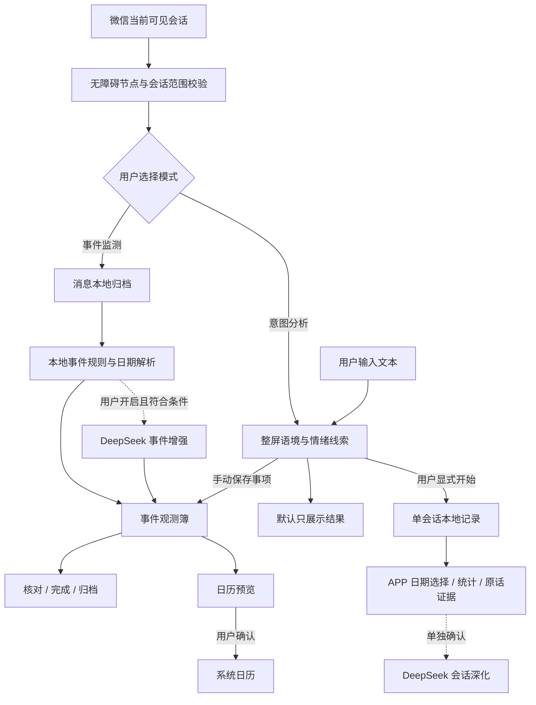

<p align="center">
  
</p>

<h1 align="center">偷闲 · Touxian</h1>

<p align="center"><strong>把注意力留给重要的事。</strong></p>
<p align="center">在微信里读懂通知、看清语境，把值得关注的消息整理成可追踪的事件。</p>
<p align="center">An Android attention assistant for visible WeChat conversations. Local-first, explainable, and always under your control.</p>

<p align="center">
  <a href="https://github.com/sssssjw11/attention-guard/releases/tag/v1.25"></a>
  
  
  <a href="LICENSE"></a>
</p>

<p align="center">
  <a href="https://github.com/sssssjw11/attention-guard/releases/download/v1.25/touxian-1.25-debug.apk"><strong>下载 APK</strong></a> ·
  <a href="#quick-start">快速开始</a> ·
  <a href="#features">功能介绍</a> ·
  <a href="docs/releases/v1.25.md">更新与 Debug 记录</a> ·
  <a href="https://github.com/sssssjw11/attention-guard/issues">反馈问题</a>
</p>

> [!IMPORTANT]
> 当前为 **1.25 预览版 / versionCode 26**，安装包使用 **debug 签名**，不是已完成全面验收的稳定版。只支持微信；群名空节点 OCR 的实际恢复、复杂语义和跨机型表现仍有待验证。请核对原始消息，不把规则评分当作事实或真实情绪概率。

**1.25 合并 1.23–1.25 的迭代。** 在会话记录、深度分析和诊断基础上，修复标题绑定与滑动后的群名恢复，新增自定义消息关键词、事件类型和重要性规则。完整变更、根因与验证边界见 [1.25 更新与 Debug 记录](docs/releases/v1.25.md)。

1.25 的正文关键词入口：微信「事件监测 → 更多 → 消息关键词」，或 APP「规则与外观 → 消息正文关键词」。每条规则可设置关键词、事件类型、P0–P3 重要性并单独启停；保存后重新分析当前可见消息。它不修改会话范围，只匹配对方正文，不把群名或发送者当作命中依据。普通信息作为持续观测，明确行动要求才进入待办；停用或删除规则不会删除已保存事件。

会话记录的使用路径：微信悬浮窗切到「意图分析」后点击保存图标开始会话记录，用户自行滚动收集所需片段；离开微信、切换页面或模式后会暂停，回到目标聊天确认继续。通过「会话记录与深度分析」或 APP 首页「会话分析」查看原文、按消息日期选择范围并分析。关系结论引用原话，分开双方情绪、支持、边界与互动线索；不是被爱概率。只采集可见内容，不宣称是完整历史；相同显示名也不是微信稳定会话 ID。

意图模式不会自动创建事件。需要保留事项时在悬浮窗更多菜单点击「保存当前事项」。遇到“识别后 APP 没显示”，在「采集与回溯 → 诊断 → 导出诊断报告」导出 JSON；可区分权限状态、当前模式、事件写入失败和页面筛选隐藏。报告含运行统计与最近 80 个阶段状态，不含聊天正文、会话名、截图或 API Key。

## 导航

[为什么做偷闲](#why) · [功能介绍](#features) · [模式对比](#modes) · [下载安装](#download) · [快速开始](#quick-start) · [使用指南](#usage) · [权限与数据](#privacy) · [工作原理](#architecture) · [构建与测试](#development) · [常见问题](#faq) · [已知限制](#limits) · [路线图](#roadmap) · [参与贡献](#contributing)

<a id="why"></a>
## 为什么做偷闲

群聊里真正需要行动的信息，常常散落在通知、补充说明、改期和催办之间。看见消息，不等于记得处理；收藏消息，也不等于知道它后来有没有变化。

偷闲围绕一个简单流程设计：

**发现值得关注的消息 → 核对事件与依据 → 完成或归档 → 必要时确认加入日历。**

- **效率优先**：在微信里看结果，用勾选和批量操作减少来回切换。
- **来源可查**：保留会话、发送者、采集时间、判断依据和事件更新。
- **模式清楚**：监测事项和分析语境分开，不把一次情绪表达自动变成待办。
- **本地优先**：基础识别和关系报告无需 API Key；联网事件增强与会话深化由你单独选择。
- **用户决定**：不自动回复、不代发消息、不后台扫描全部群聊、不自动写日历。

适合校园通知、课程安排、班会、竞赛、活动和就业信息较多的人。它不是完整聊天备份工具，也不是读心工具。

<a id="features"></a>
## 功能介绍

| 能力 | 具体能做什么 |
| --- | --- |
| **微信事件监测** | 从当前可见消息识别大致事件、行动要求、截止时间、重要程度和事件类型。支持教务 / 行政、课程、就业、竞赛、班会 / 会议、活动等类别。 |
| **持续意图分析** | 结合当前屏幕可读聊天语境，展示可能意图、重要性、语境置信度和情绪线索；聊天变化或翻页后更新，直到手动切回事件监测。 |
| **自由文本分析** | 在应用内输入或粘贴内容，按“我： / 对方：”分段分析；不需要会话名称，不写入事件簿。 |
| **可收起悬浮窗** | 完整面板、紧凑工具条、小球三级显示；展开面板约半屏宽，支持拖动与背景 0–100% 不透明度设置。文字、图标保持可读。 |
| **会话标记与范围** | 一键把当前会话加入识别词条。处理空格、全半角、人数后缀及短英文 / 数字边界，减少错误匹配。 |
| **消息正文关键词** | 手动指定正文关键词、事件类型、重要性并启停；不改变会话范围，不匹配群名和发送者，命中依据写入事件详情。 |
| **会话记录与深度分析** | 意图模式显式开始单会话记录，APP 按消息日期查看与分析；全量统计、关键语境和原话证据分开展示，可单独确认 DeepSeek 深化。 |
| **事件观测簿** | 查看原始依据与更新记录，直接勾选完成，归档或恢复事件。归档不是删除。 |
| **组合检索** | 按关键词、处理状态、采集日期和 P0–P3 重要程度组合筛选；日期支持当天、近 3 天、近一周。 |
| **批量归档** | 全选覆盖当前筛选结果，不限于首屏或前 20 条；全选、数量、退出与归档命令分开布局。 |
| **确认后写入日历** | 预填可确认的日期，保留明确时间；仅有日期时默认 10:00，提醒默认开始时。记住目标日历，确认后才写入，并做重复写入检查。 |
| **有界历史回溯** | 用户主动启动后逐屏保存消息、检查重叠和日期缺口；可手动翻页或选择受限的慢速自动翻页。 |
| **可导出诊断** | 查看连接、权限、读取、判定、入库与列表状态，通过系统选择器导出结构化 JSON；不包含聊天正文、会话名、关键词内容或密钥。 |

### 1.25 更新重点

- 新增正文关键词管理，类型与重要性由用户配置，保存后立即重新分析可见页。
- 修复滚动后的标题绑定失效，增加有界本机标题 OCR 恢复，仍严格防止跨会话复用。
- 新增单会话记录、消息日期筛选、本地关系报告和可选 DeepSeek 深化。
- 修复识别到 APP 入库与刷新竞态，意图模式支持手动保存事项及可导出诊断。
- 补充否定、完成、引用和多人情绪归属回归，关键词与行动判断不互相覆盖。

[更新与 Debug 记录](docs/releases/v1.25.md) · [1.25 实施记录](docs/iteration-1.25.md) · [1.24 群名排查](docs/iteration-1.24.md) · [1.23 记录与分析](docs/iteration-1.23.md)

<a id="modes"></a>
## 三种分析方式

| | 事件监测 | 微信意图分析 | 自由文本分析 |
| --- | --- | --- | --- |
| 入口 | 微信悬浮窗 | 微信悬浮窗内切换 | 应用内“自由分析” |
| 内容来源 | 当前可见微信会话 | 当前屏幕可读对话语境 | 你主动输入或粘贴的内容 |
| 主要结果 | 事件、类型、重要性、期限、依据 | 可能意图、重要性、情绪线索、置信度 | 输入内容的语境与意图判断 |
| 需要会话名 | 需要可靠名称以确认范围与来源 | 分析不需要；显式记录或保存事项需要 | 不需要 |
| 保存消息 / 事件 | 符合采集范围时保存消息，命中规则时整理事件 | 默认不写；显式记录才保存消息，手动保存事项才写事件 | 不写事件簿 |
| 联网分析 | 可选 DeepSeek 事件增强，默认关闭 | 本地规则，不调用云端 | 本地规则，不调用云端 |
| 停止方式 | 暂停观测或切换模式 | 手动切回事件监测或暂停 | 离开输入页 |

**模式切换不会删除以前的记录。** 意图分析只读取有依据的文字或贴纸语义；只有图片占位符时，不假装已经看懂图片。

微信实时意图分析不调用云端。APP 的会话深度分析是独立流程，默认本地；点击并确认 DeepSeek 深化后才联网发送选定内容。

<a id="download"></a>
## 下载安装

| 下载项 | 地址 |
| --- | --- |
| **Android APK · 1.25 预览版** | [touxian-1.25-debug.apk](https://github.com/sssssjw11/attention-guard/releases/download/v1.25/touxian-1.25-debug.apk) |
| 校验文件 | [touxian-1.25-debug.apk.sha256](https://github.com/sssssjw11/attention-guard/releases/download/v1.25/touxian-1.25-debug.apk.sha256) |
| 发布详情与历史版本 | [1.25 发布页](https://github.com/sssssjw11/attention-guard/releases/tag/v1.25) · [全部 Releases](https://github.com/sssssjw11/attention-guard/releases) |

- **系统要求**：Android 11 / API 30 及以上。最低版本来自项目配置，不代表所有版本均通过真机测试。
- **包名**：`com.attentionguard.app`，更名为“偷闲”后保留原包名。
- **包类型**：debug 签名预览包，约 58.1 MiB；中文 OCR 模型随 APK 打包。
- **安装方式**：在手机上下载并打开 APK，按系统提示授权对应下载应用安装；或使用 ADB。

```bash
adb install -r touxian-1.25-debug.apk
```

> [!WARNING]
> 优先覆盖安装，保留本地记录。若出现“签名不一致”，**不要直接卸载**：卸载会删除本地事件、消息、密钥及设置。本项目尚未提供完整备份恢复工具；先确认数据保留方案。不要混装未知来源或不同签名的安装包。

<details>
<summary>核对 SHA-256</summary>

```text
e4c67eb4c43bfcdd64c2279c92b8379082c5023213ecd40053cee47790314c39  touxian-1.25-debug.apk
```

Windows PowerShell：

```powershell
Get-FileHash .\touxian-1.25-debug.apk -Algorithm SHA256
```

Linux：

```bash
sha256sum -c touxian-1.25-debug.apk.sha256
```

macOS：

```bash
shasum -a 256 touxian-1.25-debug.apk
```

本地构建不承诺与此发布包逐字节相同；不同签名、工具链或构建环境会改变哈希。
</details>

<a id="quick-start"></a>
## 快速开始

### 1. 先在应用里认识它

安装并打开偷闲。主界面分为 **注意力、观测簿、来源、我的**。

- 在“我的”打开 **示例模式**，可用内置示例浏览界面，不把示例操作计入真实事件。
- 在“自由分析”输入内容即可试用本地语境判断，不必先配置 API Key。
- 公开仓库不放真实聊天截图；界面规则见 [设计文档](DESIGN.md) 和 [交互约定](UX-CONTRACT.md)。

### 2. 开启当前微信会话观测

1. 从“我的”进入无障碍授权，为偷闲开启服务。
2. 在“规则与外观”设置会话识别词条，或进入微信后手动标记当前会话。
3. 打开自己有权查看的微信文字聊天，等待悬浮窗读取当前屏幕。
4. 选择 **事件监测** 或 **意图分析**，根据需要收起为紧凑工具条或小球。

**识别词条为空表示不按会话名称限制范围，不是自动遍历全部会话。** 第一次加入词条会收窄观测范围。标题无法确认时，请核对或手动补全，不要用发言者昵称代替群名。

### 3. 看结果，再决定是否行动

在观测簿打开事件，核对类型、重要性、期限及来源依据。已处理就勾选完成；暂时不需要展示就归档；希望进入日历则先打开预览，再确认写入。

基础功能无需云端配置。只有希望增强事件整理时，才到设置填写自己的 DeepSeek API Key、测试连接并开启联网增强。

<a id="usage"></a>
## 使用指南

### 从通知到事件

以下为虚构示例，不来自用户聊天：

> 请同学们在 2026 年 10 月 9 日 17:00 前提交课程报告，文件按指定格式命名。

偷闲会尝试抽取课程类事件、行动要求、绝对期限和原始依据。后续补充和更正可能合并到事件更新中。**最终结果受可见内容、日期来源及规则影响，应以详情中的原文为准。**

- 正文明确的事件类型优先于群名；群名只在缺少正文类别线索时补充。
- “28 号”但缺少消息日期时，保留“日期待核对”，不猜月份。
- 明确过去的截止日期不会被自动滚成下个月。
- 内置 P0 受到本地期限与行动证据约束，联网模型不能绕过这些门槛。自定义正文规则按用户选择的重要性记录，命中关键词本身不等于有行动要求。

### 正文关键词与会话范围

在微信事件监测更多菜单打开「消息关键词」，或在 APP「规则与外观」打开「消息正文关键词」。增加关键词后选择类型、重要性并保存；开关用于启停，删除需确认。

会话范围与正文规则独立：新增正文规则不会让范围外会话自动进入监测。只匹配对方原生文字正文；普通信息作为持续观测，取消、完成和过期不升级紧急提醒。停用规则不会撤销旧事件，依据保留在详情。

### 检索、完成与归档

观测簿支持关键词、处理状态、日期、重要性组合筛选。关键词匹配事件标题、摘要、来源会话和发送者。

**“当天 / 近 3 天 / 近一周”按采集时间筛选，不是按截止日期筛选。**

点击“批量归档”进入选择状态，再使用全选或逐条勾选；确认范围后点击归档。全选作用于当前全部筛选结果。点击退出会清空本次选择，不归档任何事件。归档内容可在归档筛选中查看和恢复。

### 意图与情绪线索

意图模式结合整屏可读上下文判断当前对方发言，不只看上一条消息。自己说过的话可作为语境，但不会直接作为对方情绪证据；已知不同群成员的情绪也不会直接混用。

结果可能包含关切、积极、负向、调侃、回避或混合线索。只有明确表情时显示“表情线索”，并降低把握度；上文证据会标明来自上文。

**置信度是可解释的规则评分，不是正确率、感情程度或临床判断。** 同样的证据得到相同分数是正常行为；增加具体文字证据或改变上下文，才应使分数变化。

自由输入支持 `我：` / `对方：`，也支持 `Me:` / `Them:`；最多使用输入末尾 12,000 个字符。

### 单会话记录与深度分析

1. 在微信意图面板点击保存图标，确认完整会话名后开始记录，自行翻页收集需要的片段。
2. 离开微信、切换页面、锁屏或切模式会暂停；回到目标会话后确认继续，结束后保留已保存内容。
3. 在 APP「会话分析」选择记录与消息日期范围，可单独包含日期未确认消息，查看原文、统计、证据与本地报告。
4. 需要可选云端深化时，先核对选定范围，再点击并确认 DeepSeek 深化；取消或失败保留本地结果。

关系程度是基于现有证据的候选解读，不是被爱概率。群成员不合并为一个对方，拒绝不解释为喜欢，采集时间不当作发送或回复时间。只记录可见内容，不保证完整历史。

### 导出诊断

APP「采集与回溯 → 诊断 → 导出诊断报告」选择保存位置，导出 JSON。报告包含权限、心跳、读取/判定/入库/展示阶段与数量，不需要额外文件存储权限，不导出聊天正文、会话名、截图、关键词内容或密钥。复现问题时附最短步骤和去标识样例，详见 [Debug 说明](docs/releases/v1.25.md)。

### 确认后加入日历

1. 在事件详情点击“加入日历待办”。
2. 核对标题、日期、时间 / 全天、提醒方式和目标日历。
3. 点击 **确认并写入**；返回或关闭预览不会写入。

可确认的绝对日期会预填；原文明确给出时间时保留该时间，仅有日期时默认当天 **10:00**。提醒默认 **开始时**，目标日历记住上次选择。日期不能确认或日历不可写时，需要先处理提示。重复确认会进行事件标记查重。

应用内完成或归档 **不会同步修改系统日历**。系统日历是否同步到其他设备，取决于所选日历账户的设置；此处创建的是日历事件，不是第三方独立待办服务。

### 历史回溯

从“来源”或“我的”进入“采集与回溯”，填写目标会话与日期范围。默认手动翻页；主动选择自动回溯后，才会执行受限的慢速翻页。

- 自动翻页间隔至少 4 秒；单任务最多 200 屏 / 200 次翻页，或 15 分钟。
- 每屏先保存，再翻页；通过相邻屏重叠减少重复，并记录日期不明和分页缺口。
- 离开会话、暂停、正文不可读或失去可靠范围时停止自动操作；重启不会自动继续。
- 这不是微信全量数据库导出，不能保证完整历史覆盖。

<a id="privacy"></a>
## 权限与数据

### 需要哪些权限

| 能力 / 权限 | 用途与边界 |
| --- | --- |
| 无障碍服务 | 读取前台微信可见节点、显示无障碍悬浮窗；用户启动回溯后执行受限翻页。 |
| 前台服务与通知 | 展示持续观测状态，帮助应对设备后台管理；**不是通知监听权限**。 |
| 应用悬浮权限 | 保留可选入口；核心微信卡片使用无障碍悬浮窗，不依赖额外悬浮授权。 |
| 日历读写 | 在用户选择日历流程中请求；确认前不创建事件。 |
| 网络 | 可选 DeepSeek 连接测试、事件增强与 APP 会话深化；后者另需用户确认。 |
| 本机 OCR | 可选功能，默认关闭；开启后事件模式可限频恢复缺失标题，手动标记也可能使用一次本机标题 OCR，保留确认流程。 |

### 数据放在哪里

- 事件与会话录制元数据、报告保存在应用私有文件；事件模式与显式会话记录的消息保存在本机私有 SQLite。
- 意图分析默认不保存消息、不自动写事件；显式开始记录或手动保存事项是独立操作。自由文本分析不写事件簿，关闭模式不删除旧记录。
- API Key 使用 Android Keystore AES-GCM 加密存放；调用接口时会通过 HTTPS 发送给 DeepSeek。
- 事件、消息及回溯摘要没有额外的应用层加密；系统备份已禁用。请妥善保管设备。
- OCR 截图仅在内存处理。清空消息存档不会同时删除事件已有依据。

### 开启联网增强后会发送什么

自动事件增强仅处理事件模式下的符合条件请求。请求可能包含：当前会话名称、最近至多 **12 条**可见消息及发送者 / @ 信息、每条最多 **2,000 字符**的正文、最多 **2,000 字符**的自定义群聊语境、当前时间和本地初步判断。自定义正文规则决定的事件不由云端改写类型和重要性。

APP 会话深化是另一个用户确认流程：发送选定范围的本地统计、会话名称与关键语境，最多 **90 条**消息，每条最多 **2,000 字符**，包含发送者、日期、可用的消息时间和原文。日期选择用于限制本次数据范围，模型引用必须与发送的原话一致。

连接测试使用内置示例。回溯消息和 OCR 待核对正文不进入自动事件增强；微信实时意图与自由文本分析不调用云端。**可选云端深化不等于全程离线**，也不代表上传完整历史；请在理解范围后确认。

偷闲不 hook 微信、不改微信安装包、不读取微信聊天数据库、不自动填入消息框，也不执行发送、转账或红包操作。

<a id="architecture"></a>
## 工作原理



### 技术栈与模块

**Kotlin · Android 原生 View · Material Components · ML Kit 中文 OCR · JUnit · Robolectric**。当前不是 Compose 项目，也不需要部署后端。

```text
app/src/main/java/com/attentionguard/app/
├── MainActivity.kt          # 注意力首页、观测簿、来源、个人页
├── MarkChatActivity.kt      # 会话名称确认
├── CustomIntentActivity.kt  # 自由文本分析
├── MessageKeywordActivity.kt # 消息正文规则管理
├── ConversationAnalysisActivity.kt # 会话记录、日期与关系报告
├── CalendarActivity.kt      # 日历写入预览与确认
├── capture/                # 前台采集、群名、OCR、回溯、诊断
├── core/                   # 事件、日期、范围匹配、意图与持久化
├── overlay/                # 微信内三级悬浮窗
├── calendar/               # 日历草稿与写入
├── ai/                     # 可选 DeepSeek 官方直连
└── ui/                     # 共享控件、配色、字体与动效
app/src/test/               # 针对性单元与界面逻辑回归
docs/                       # 设计、迭代、发布与真机验收
scripts/                    # APK 检查与设备端规则验证
```

保留 `com.attentionguard.app` 包名与历史服务组件名是为了兼容已有安装，不表示应用隶属于系统或微信官方。

<a id="development"></a>
## 构建与测试

### 环境

| 项目 | 要求 |
| --- | --- |
| JDK | 推荐 17；Java / Kotlin 编译目标均为 17 |
| Gradle | 使用仓库 Wrapper，8.9 |
| Android SDK | Platform 35，Build Tools 35.0.0 |
| 应用配置 | minSdk 30 / targetSdk 35 / compileSdk 35 |

```bash
git clone https://github.com/sssssjw11/attention-guard.git
cd attention-guard
```

在本机 `local.properties` 配置 Android SDK 路径，或使用 Android Studio 的 SDK 配置。该文件不提交 Git。首次构建需要下载 Gradle 与依赖。

**macOS / Linux**

```bash
chmod +x gradlew
./gradlew :app:assembleDebug
```

**Windows PowerShell**

```powershell
.\gradlew.bat :app:assembleDebug
```

产物：`app/build/outputs/apk/debug/app-debug.apk`。建议 Windows 使用不含特殊字符的 SDK / 工作目录；本仓库不要求固定盘符。

<details>
<summary>Release 签名构建</summary>

将签名配置放在仓库之外的 properties 文件，包含 `storeFile`、`storePassword`、`keyAlias`、`keyPassword`。设置环境变量 `ATTENTION_GUARD_KEYSTORE_PROPS` 指向该文件，再执行：

```bash
./gradlew :app:assembleRelease
```

没有签名配置时生成未签名 release 产物。不要提交私钥、密钥库、密码或机器配置。自行签名的 release 包通常不能直接覆盖本项目当前 debug 签名包。
</details>

### 针对性回归

```bash
./gradlew :app:testDebugUnitTest \
  --tests 'com.attentionguard.app.capture.WeChatAdapterTest' \
  --tests 'com.attentionguard.app.core.AttentionEngineTest' \
  --tests 'com.attentionguard.app.core.JevIntentEngineTest'
```

Windows 可将 `./gradlew` 换成 `.\gradlew.bat`，并把命令写为一行。测试报告位于 `app/build/reports/tests/testDebugUnitTest/index.html`。

APK 规则标记检查：

```powershell
.\scripts\verify-apk.ps1 -Apk .\app\build\outputs\apk\debug\app-debug.apk
```

### 当前验证情况

- **1.25 发布回归**：21 个受影响测试类共 296 项 JUnit / Robolectric 测试通过，失败 0、错误 0；各轮重叠数量不累加。
- **安装包**：APK 构建、版本、规则标记与签名核对通过，最终 1.25 已真机覆盖安装。
- **本轮真机**：微信 8.0.78，标题可读时 6 次连续滚动保持监测；正文关键词命中、保存与 APP 展示、编辑保存和删除确认已验证。
- **仍待验证**：空标题的真实 OCR 恢复、长时间跨页录制、同名会话、诊断系统导出完整交互与更多机型。模拟模型测试不等于真实联网调用。

测试范围、失败历史与未验证项见 [1.25 更新与 Debug](docs/releases/v1.25.md)；历史记录见 [1.22 真机验收](docs/device-acceptance-1.22.md)。不以测试数量代替准确率或兼容性承诺。

<a id="faq"></a>
## 常见问题

<details>
<summary><strong>需要 API Key 吗？有后端要部署吗？</strong></summary>

基础事件判断、意图分析、自由文本与本地关系报告无需 API Key 或自建后端。DeepSeek 为可选事件增强或确认后的会话深化，使用你自己的账户与额度。
</details>

<details>
<summary><strong>为什么群名在微信里看得到，偷闲却没识别到？</strong></summary>

微信绘制的文字不一定通过无障碍节点开放。1.24 起对事件页缺失标题增加了有界本机 OCR 恢复，并修正滑动后绑定失效；仍需本机 OCR 开关和可用截屏。手动标记保留信息页、OCR 与用户确认路径，省略名称不能当作完整群名。空标题实际 OCR 恢复与完整回退链路仍待进一步真机验证。
</details>

<details>
<summary><strong>小球、菜单或悬浮窗没有出现怎么办？</strong></summary>

先确认当前是微信文字聊天，而非聊天列表、网页或其他应用，再检查偷闲无障碍服务与观测开关。“来源 → 采集与回溯”可查看运行诊断。覆盖安装后如果服务未恢复，可关闭再开启一次无障碍授权；同时检查设备省电、自启动及后台限制。不要通过清空数据来排查。
</details>

<details>
<summary><strong>为什么把握度不总是在变？</strong></summary>

它不应随机变化。相同文字与上下文可能产生相同评分；具体行动、明确期限、更多独立情绪文字或不同语境才会改变证据强度。单个表情不会被当作高置信度真实情绪，重复表情也不会堆高分数。
</details>

<details>
<summary><strong>会读取所有微信群，或者自动回复吗？</strong></summary>

不会后台遍历全部会话，也不会发送回复。基础采集只处理前台当前可见微信内容。历史回溯必须主动启动，并受目标会话和翻页限制约束。
</details>

<details>
<summary><strong>开启意图分析之后，为什么观测簿没有新事件？</strong></summary>

意图模式默认只展示语境，不自动创建事件。需要保留事项时用更多菜单「保存当前事项」，或切回事件监测；需要保存聊天片段时显式开始会话记录，两者不是同一个保存动作。疑似识别后没显示时导出诊断，区分未创建、写入失败与筛选隐藏。
</details>

<details>
<summary><strong>为什么日历没有写入，或者默认时间是上午十点？</strong></summary>

打开预览不代表已经写入。先确认绝对日期、可写目标日历与权限，再点“确认并写入”。仅有日期时默认 10:00；原文已有明确时间则保留该时间。提醒是否通知由系统日历与手机设置负责。
</details>

<details>
<summary><strong>可以同时支持飞书、QQ 或其他应用吗？</strong></summary>

当前只专注微信，其他平台适配不在本轮范围。自由文本分析允许主动粘贴内容，但不代表自动采集其他应用。
</details>

<a id="limits"></a>
## 已知限制

| 方面 | 当前边界 |
| --- | --- |
| 群名 | 标题恢复和滑动绑定已实现，但空标题实际 OCR 与“信息页 → 确认 → 返回绑定”的完整真机验收未完成；同名不等于稳定会话 ID。 |
| 语义 | 本地启发式规则可能误判，尤其是反讽、表演性生气、混合情绪、多成员短回复；不是已训练并校准的情绪模型。 |
| 媒体 | 不理解任意图片表情、语音、视频或文件正文；未知占位符不等于已经理解内容。 |
| 历史 | 日期标签缺失、快速滚动、同名会话及断点可能造成重复或遗漏；不是全量备份。 |
| 设备 | 目前真机覆盖有限，后台保活、键盘遮挡、分屏、旋转、TalkBack 和跨机型仍需验证。 |
| 数据规模 | 事件存储暂无大规模数据库分页与自动清理策略，记录较多时需进一步性能验证。 |
| 联网 | JSON 结构合法不代表事实正确。网络失败保留本地判断；请自行确认外部服务的数据处理与费用。 |

<a id="roadmap"></a>
## 路线图

以下是迭代方向，不是已经交付的能力或时间承诺。

- [x] 微信单平台事件监测、持续意图分析与自由文本分析。
- [x] 三级悬浮窗、组合检索、快捷完成与批量归档。
- [x] 用户确认后写入日历，记住目标位置与默认提醒。
- [x] 标准表情线索、证据衰减、发送者归属和定向回归。
- [x] 单会话显式记录、消息日期选择、原话证据与关系深度分析。
- [x] 自定义正文关键词、类型与重要性，诊断导出和识别入库闭环。
- [ ] 完成群名不可读场景的全流程真机验收。
- [ ] 用去标识样本评估语义误判与置信度区间，而不是只扩充关键词。
- [ ] 扩大机型、微信版本、后台与辅助功能兼容性覆盖。
- [ ] 评估数据量增长后的性能，以及可控的数据导出 / 备份需求。

<a id="contributing"></a>
## 参与贡献

欢迎提交可复现的识别问题、交互改进和小范围补丁。优先解决常用功能，避免重新引入多平台适配或不必要的复杂依赖。

**报告问题时请附上：**

1. 偷闲版本、Android 版本、微信版本和手机型号。
2. 使用的模式、最短复现步骤、预期结果与实际结果。
3. 已去标识的文字样例；保留必要的时间词和语气，删除姓名、群名、号码与邮箱。
4. 必要时附“导出诊断报告”的 JSON，并再次确认没有私人信息。

请不要提交 API Key、签名文件、完整聊天导出、未经处理的截图或设备标识。提交修复时，尽量为原始误判添加一个匿名回归测试；不要把合成样例发送到真实聊天中测试。

[提交 Issue](https://github.com/sssssjw11/attention-guard/issues/new) · [查看已有问题](https://github.com/sssssjw11/attention-guard/issues) · [Pull Requests](https://github.com/sssssjw11/attention-guard/pulls)

### 文档索引

| 文档 | 内容 |
| --- | --- |
| [1.25 更新与 Debug](docs/releases/v1.25.md) | 本次发布、根因、修复、诊断与验证边界 |
| [1.25 正文关键词](docs/iteration-1.25.md) | 规则功能、对抗样本和编辑竞态 |
| [1.24 群名排查](docs/iteration-1.24.md) | 标题空节点、滑动绑定与本机恢复 |
| [1.23 记录与分析](docs/iteration-1.23.md) | 工作计划、会话记录、关系方法与诊断 |
| [1.22 发布说明](docs/releases/v1.22.md) | 安装包、主要变化与版本边界 |
| [1.22 迭代说明](docs/iteration-1.22.md) | 本轮实现与后续方向 |
| [1.22 真机验收](docs/device-acceptance-1.22.md) | 实际通过、失败历史、未验证项 |
| [设计系统](DESIGN.md) | 配色、字体、布局和动效约定 |
| [交互约定](UX-CONTRACT.md) | 事件操作、模式与界面边界 |
| [微信采集说明](docs/wechat-capture-1.4.md) | 采集机制及历史验证背景 |
| [Jev 参考项目对照](docs/jev-reference-comparison.md) | 借鉴的方法与不适用的部分 |

## 许可与致谢

本项目采用 [MIT License](LICENSE)，是独立项目，不隶属于微信、腾讯、DeepSeek 或其他参考项目。

- [Lucide](https://lucide.dev/) 提供图标，许可保留在 [docs/brand/lucide/LICENSE](docs/brand/lucide/LICENSE)。
- README 的信息组织参考 [LocalSend](https://github.com/localsend/localsend) 的下载、工作原理和贡献分区，以及 [Termux](https://github.com/termux/termux-app) 对安装来源和签名兼容性的明确说明；没有复制其品牌或功能承诺。
- Jev 相关设计借鉴与适用边界单独记录于对照文档，不以他人的测试结果代替本项目验收。

请只处理自己有权查看的内容，并遵守相关平台规则及适用要求。涉及重要期限、行动与人际判断时，始终以原始信息和本人确认作为最终依据。
