# 手机端意图分析流程检查

采用 Product Design 的现有产品审查流程，沿用 Kotlin / Android Views 与现有 GuardUi。目标是读懂当前消息、核对依据，并把明确关联的聊天带入后续分析。

## 证据与范围

以下图片均由本轮重新编译代码后，通过 Android 原生渲染器保存并逐张检查。基线为 1.26，新版为 1.26.1；视口 393 × 851 dp，图片 786 × 1702 px。对话为程序生成的示例，两个同名档案分别代表朋友与工作场景。弹窗单独渲染，黑色外围是未绘制区域。

这能检查布局、层次、可见文字、栏目切换与对话框内容；不能证明物理手机上的系统栏、输入法、TalkBack、微信窗口权限和实际手势正常。模拟器未能启动，未连接物理手机。没有调用真实 DeepSeek 或读取真实聊天。

## 按步骤检查

| 步骤 | 基线观察 | 新版状态 | 证据 |
|---|---|---|---|
| 1. 找到入口 | 首页只有自由分析与会话分析，档案入口需进入记录页后寻找 | 已补首页档案入口，与会话分析保持同一导航样式 | 01-home |
| 2. 输入对话 | 未提示如何区分双方，只有开始分析 | 已补输入格式、场景和点按 DeepSeek 的说明 | 02-free-input |
| 3. 理解当前消息 | 示例显示「暂无明确请求」和两组分数，难以决定怎样回应 | 先显示结合忙碌前文的候选解释，提供其他解释与回应草稿；规则与情绪线索可展开 | 03-free-result |
| 4. 找到正确对象 | 两个同名档案只有名称、类型和编号，无法看到记录与状态 | 可查找，卡片展示关联会话、数量与待更新原因，同名仍分开 | 04-profile-list |
| 5. 更新旧画像 | 编辑、关联、分析与闲置取消按钮占据主要位置 | 更新入口提前，显示新增数量与更新时间，可回顾过期摘要 | 05-profile-pending |
| 6. 阅读分析 | 首屏被六项统计占满，沟通结论在下方 | 结论和发现先展示，分类筛选，统计按需展开 | 06-profile-updated |
| 7. 核对引用 | 只显示原话与日期 | 增加记录来源和引用突出显示 | 07-evidence |
| 8. 核对前后文 | 缺少前后文入口 | 展开同一记录的相邻消息，并提示采集可能不连续 | 08-evidence-context |

## 前后截图

### 1. 首页入口

| 1.26 | 1.26.1 |
|---|---|
| 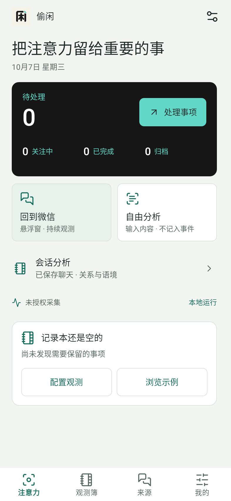 | 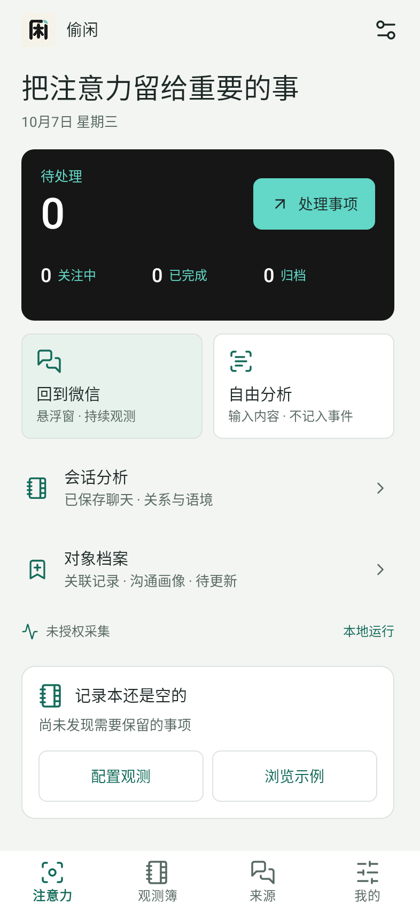 |

### 2. 自由分析输入

| 1.26 | 1.26.1 |
|---|---|
| 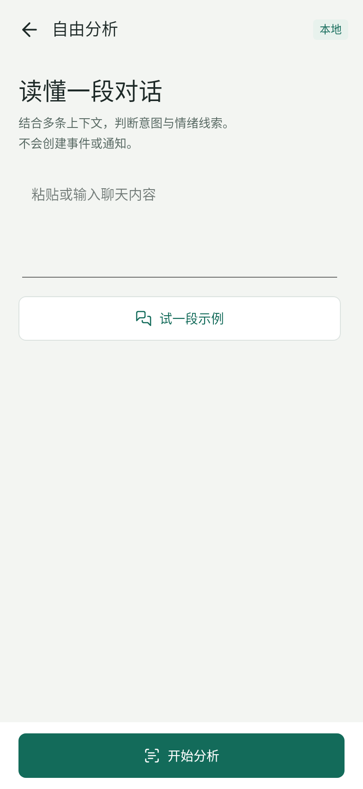 | 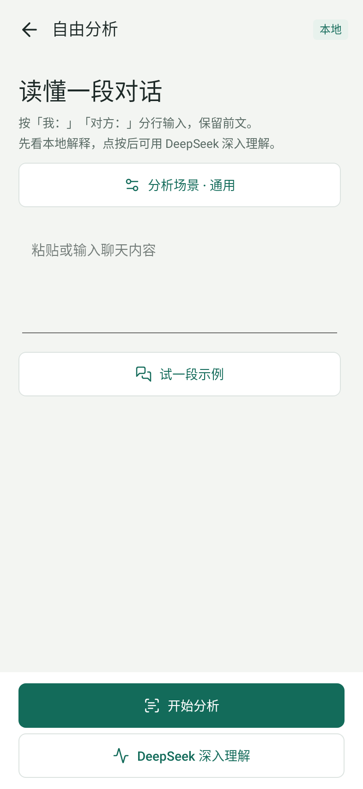 |

### 3. 当前理解

| 1.26 | 1.26.1 |
|---|---|
| 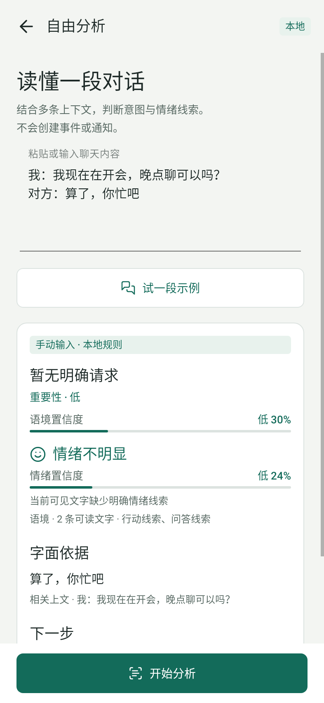 | 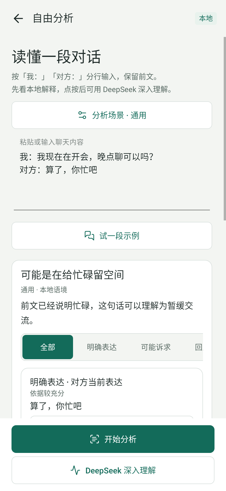 |

### 4. 同名对象列表

| 1.26 | 1.26.1 |
|---|---|
| 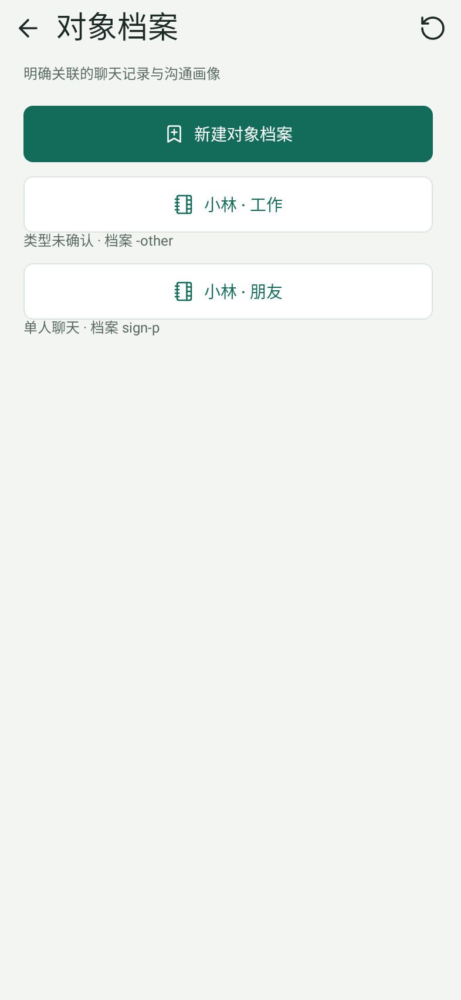 | 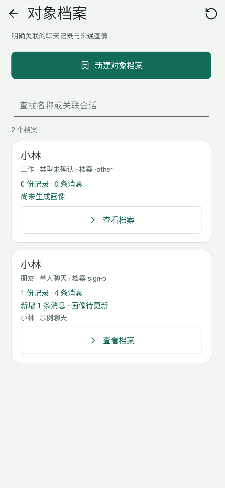 |

### 5. 待更新档案

| 1.26 | 1.26.1 |
|---|---|
| 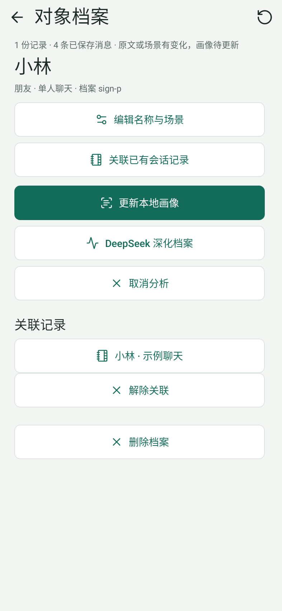 | 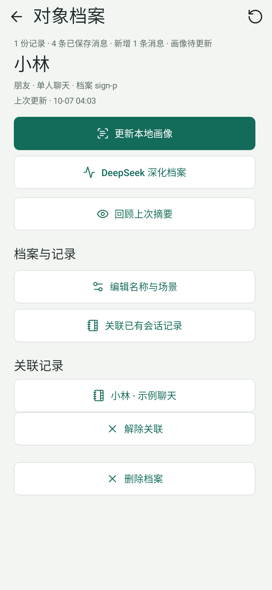 |

### 6. 更新后的画像

| 1.26 | 1.26.1 |
|---|---|
| 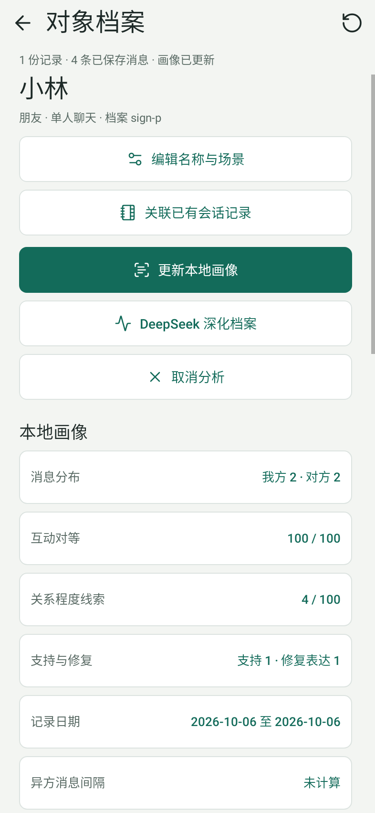 | 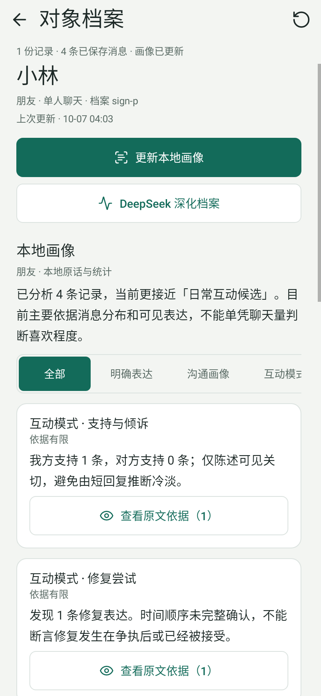 |

### 7. 原文核对

| 1.26 | 1.26.1 |
|---|---|
| 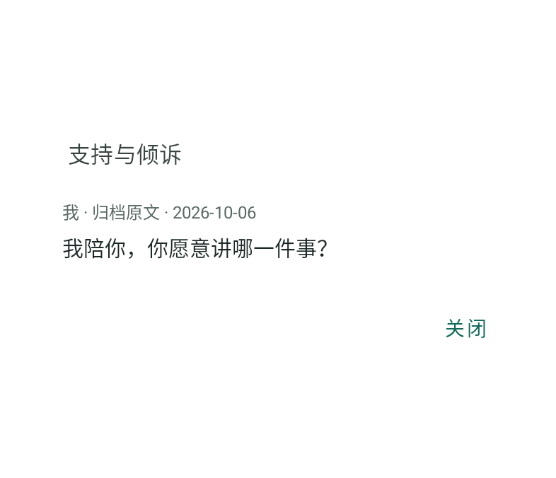 |  |

### 8. 前后文

| 1.26 | 1.26.1 |
|---|---|
|  | 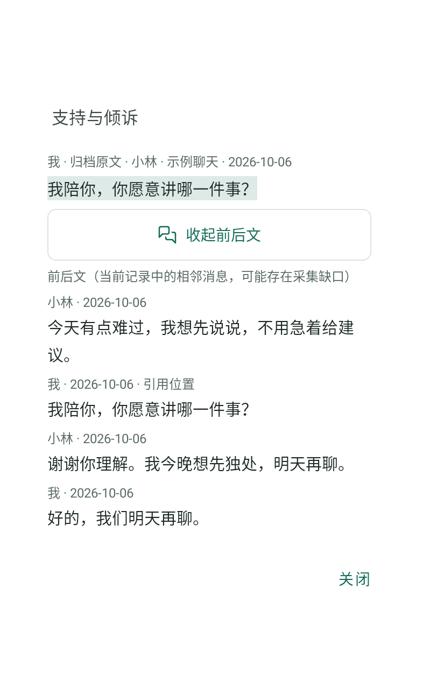 |

## 交互和可访问性检查

- 栏目筛选、复制回复、发送预览、档案查找、转移确认和关联后返回有交互测试。取消入口仅在工作时显示，不误导闲置状态。
- 新按钮沿用 48 dp 最小高度，保留返回、刷新、栏目选择状态和输入标签；长栏目可以横向滚动，报告及弹窗可以纵向滚动。
- 深化及读取反馈沿用可访问性状态提示；栏目使用原生可选按钮，复制内容仅含回复正文。
- 只核对本视口与测试中的窄屏布局。未完成系统级读屏、放大字体、键盘焦点与触摸辅助验收，不能据此声称完整无障碍合规。

## 复现

DesignCaptureTest 是可选截图入口。设置环境变量 TOUXIAN_CAPTURE_DIR 后执行该测试即可生成八个视图及对应文字；未设置变量时跳过，不写入用户数据。截图脚本只使用测试环境中的合成会话。
